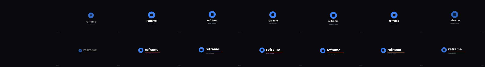
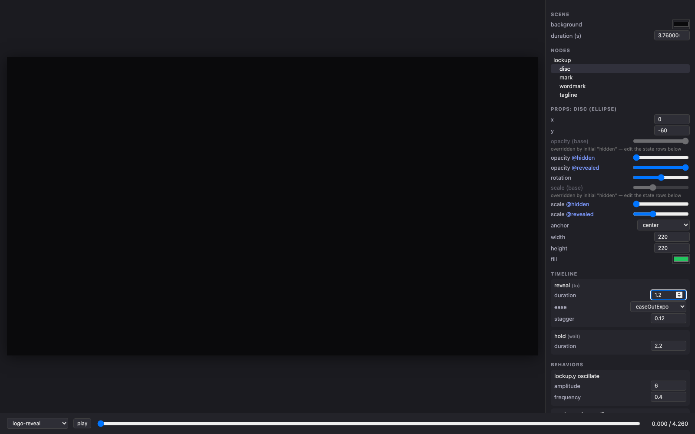

# reframe

**Declarative motion graphics that AI can write, humans can tweak — and the
human's edits survive an AI regeneration.**

At "prompt → mp4", reframe is on par with Hyperframes or a Remotion skill —
our own benchmark says exactly that, parity not superiority. **The difference
starts on the second turn**: what you get back is not freeform code but an
addressable document, so you can keep tweaking, regenerating, and scaling it
without your changes being silently lost.



*Top: a scene with human overlay edits applied (brand color, retimed reveal,
watermark). Bottom: an AI **fully regenerated** the base scene — different
layout, different timing — and the same overlay reapplied by stable id.
4 edits survived; the one renamed node was reported as an orphan, never
silently dropped.*


*The demo above is a reframe scene
([`examples/scenes/reframe-demo.ts`](examples/scenes/reframe-demo.ts)) —
render it yourself: `pnpm reframe render examples/scenes/reframe-demo.ts`.*

## The loop

```
scene.ts  ──(written by you, or by an AI given `pnpm reframe guide`)──▶  IR (plain JSON data)
   │                                                                        │
   ▼                                                                        ▼
preview: scrub + knobs ──▶ edits recorded as an overlay JSON (non-destructive)
   │                                                                        │
   ▼                                                                        ▼
render: deterministic mp4 (same input → byte-identical frames)   ◀── overlay reapplies
                                                                     even after an AI
                                                                     regenerates the base
```

Everything is a pure function of time: `evaluate(scene, t)` — no wall clocks,
no randomness without a seed, scrubbing and distributed rendering for free.

## Generative choreography at scale

The kind of scene that is hand-rolled timeline math in GSAP or per-element
`interpolate()` plumbing in React is ~100 lines here, because the host
language *generates* the nodes, states, and phase-shifted behaviors — and the
output is still data: **every dot, glyph, and moon keeps a stable id you can
tweak in the preview.**

| | |
|---|---|
|  |  |
| [`bloom.ts`](examples/scenes/bloom.ts) — 300 dots on a golden-angle spiral: radial bloom, traveling breath wave, chromatic ripple, vortex collapse | [`wavefield.ts`](examples/scenes/wavefield.ts) — physical interference: 1,152 phase-shifted oscillators on a 32×18 grid, second ripple source joins mid-scene |
|  |  |
| [`orbit.ts`](examples/scenes/orbit.ts) — nested transform composition: moons orbit planets orbit a sun, the whole system tilts — three nested groups, three linear tweens | [`typewave.ts`](examples/scenes/typewave.ts) — character-level kinetic type: cascade, standing wave, shatter with spin, and a second phrase assembling from the debris |
|  | |
| [`glyph-reveal.ts`](examples/scenes/glyph-reveal.ts) — the archival stop-motion format: AI-generated plates as `image` nodes, ~7fps hard cuts, push-in, camera shake, a tick per cut. Swap any plate from an overlay or batch row: `nodes.frame-3.src` | |

## Why not just Hyperframes / Remotion?

Because their output is arbitrary HTML/React — great to generate once,
impossible to safely operate on afterwards. reframe's output is data with
stable addresses, and everything below falls out of that one difference:

| the second turn | HTML / React output | reframe |
|---|---|---|
| "tweak just the color and timing" | edit code by hand, or re-prompt and hope nothing else changes (no visual editor is *possible* over arbitrary code) | turn knobs in the preview — no code |
| "now redesign it" after my tweaks | your hand edits live inside the code; regeneration overwrites them or you merge diffs — silent loss is the default | edits live in an overlay; they reapply onto the regenerated scene (measured 100% across 23 regenerations/turns), breaks are reported loudly |
| "make 50 personalized versions" | only what the author pre-parameterized (props) | any address, post-hoc: `nodes.name.content` |
| "is it wrong before I render?" | semantic failures are invisible until pixels (wrong text, off-frame) | structure validates pre-render with actionable errors; motion is computable from the IR |

If your video is fire-and-forget, use the simpler tool. If it's an asset that
will be tweaked, regenerated, and multiplied — that loop is what reframe is for.

## Quickstart

No clone needed — [`reframe-video` is on npm](https://www.npmjs.com/package/reframe-video):

```bash
brew install ffmpeg                  # system dep (or apt install ffmpeg)
npx playwright install chromium      # one-time browser download
npx reframe-video new hello          # scaffold hello.ts in any directory
npx reframe-video render hello.ts    # → out/hello.mp4
```

Using Claude Code? Install the skill and just describe the video you want:

```
/plugin marketplace add kiyeonjeon21/reframe
/plugin install reframe@reframe
```

To hack on reframe itself, clone-based setup:

```bash
brew install ffmpeg                          # 0. system dep (or apt install ffmpeg)
pnpm install                                 # 1.
pnpm exec playwright install chromium        # 2. one-time browser download
pnpm reframe render examples/scenes/lower-third.ts   # 3. → out/lower-third.mp4
```

Then open the editor and render with your edits:

```bash
pnpm reframe preview     # scrub, play, and edit any scene with knobs
# → edits accumulate in an overlay; click "download", save to examples/overlays/
pnpm reframe render examples/scenes/logo-reveal.ts \
  --overlay examples/overlays/brand-edits.json
```

> **Saving edits**: the preview never modifies your scene file. Edits live in
> an overlay document — download it from the panel, then pass it to render
> with `--overlay`. That same file keeps working after the scene is redesigned.

## The edit-survival demo

```bash
pnpm reframe demo    # renders out/demo-{1,2,3}-*.mp4
```

Renders the base scene, the base + a human overlay, and then an
**AI-regenerated base + the same overlay**. Watch the console: surviving edits
apply, the deliberately renamed node orphans loudly with a diagnosis. This is
the project's core claim, reproducible in one command. (Measured with real
agents: 100% id/state/label retention across 8 regenerations —
`benchmark/regen/REGEN-ANALYSIS.md`.)

## Sound that follows the motion

Because choreography is data, audio cues anchor to **timeline labels**, not
to seconds on a waveform:

```ts
audio: {
  bgm: { synth: "ambient-pad", gain: 0.3, duck: { depth: 0.5 } },
  cues: [{ at: "enter", sfx: "whoosh" }, { at: "shatter", offset: 0.18, sfx: "thud" }],
}
```

Retime a step with an overlay — or let an AI regenerate the scene — and the
sound design moves with it (verified: a +1.8s hold patch shifted the anchored
cues by exactly +1.8s). SFX are procedurally synthesized (deterministic, zero
assets) with CC0 samples in `assets/sfx/` for organic sounds like real
mechanical keypresses; the bed auto-ducks under cues. `--no-audio` to skip.

## Batch rendering: data in, videos out

A scene is a template; every data row becomes an overlay. Row keys are
overlay addresses — no new schema:

```jsonc
// examples/data/team.json
[{ "_name": "alice",
   "nodes.name.content": "Alice Park",
   "nodes.role.content": "Chief Technology Officer",
   "nodes.bar.fill": "#00C2A8" }, ...]
```

```bash
pnpm reframe batch examples/scenes/lower-third.ts examples/data/team.json
# → out/batch/alice.mp4, ben.mp4, ... + batch-report.json
```

Rows render in parallel; a row with a bad address renders with a loud orphan
warning instead of killing the batch. CSV works too (headers = addresses).
This is N-personalized deterministic videos from one template — the workflow
real-time runtimes like Rive structurally don't cover.

## Writing a scene

```ts
import { scene, text, seq, to, wait } from "@reframe/core";

export default scene({
  id: "hello",
  size: { width: 1920, height: 1080 },
  fps: 30,
  background: "#101014",
  nodes: [
    text({ id: "title", x: 960, y: 540, anchor: "center",
      content: "Hello", fontFamily: "Inter", fontSize: 120, fontWeight: 800, fill: "#FFF" }),
  ],
  // base props are the finished design; states are sparse overrides
  states: {
    hidden: { title: { opacity: 0, y: 580 } },
    shown:  { title: { opacity: 1, y: 540 } },
  },
  initial: "hidden",
  // labels are stable addresses for overlay timing edits
  timeline: seq(
    to("shown", { duration: 0.6, ease: "easeOutCubic", label: "enter" }),
    wait(2, "hold"),
  ),
});
```

Scaffold one with `pnpm reframe new my-scene`. Full syntax (node types,
states, timeline operators, behaviors): `pnpm reframe guide` — the same
~1,700-token guide that lets an LLM write valid scenes on the first try
(33/33 first-attempt renders in our benchmark).

A scene is a single self-contained file, not an app: it can live in **any
directory** — no package.json or node_modules next to it. `render` bundles it
on the fly (resolving `@reframe/core` and any relative imports beside it), and
`preview` lists scenes from the directory you launched it in alongside the
repo's `examples/scenes/`. Keep overlays and batch data files right next to
your scene.

## CLI

| command | what it does |
|---|---|
| `pnpm reframe render <scene.ts\|.json\|.html> [--overlay f]... [-o out]` | deterministic mp4 (mode inferred from extension; output defaults to `out/`) |
| `pnpm reframe batch <scene.ts> <data.json\|csv> [-o dir] [--overlay f]...` | one mp4 per data row (rows = overlays), parallel, with a per-row report |
| `pnpm reframe preview` | scrub/play/edit UI; edits export as overlay JSON |
| `pnpm reframe new <name>` | scaffold a documented starter scene |
| `pnpm reframe motion <mp4\|framesDir>` | calibrated motion profile (speeds, easing, discontinuities) |
| `pnpm reframe trace <ref.mp4> [--apply scene.ts]` | extract a video's motion structure (a `MotionSketch`); `--apply` emits a timeline that re-tells it on your own nodes |
| `pnpm reframe guide [--regen]` | print the authoring guide / the regeneration contract |
| `pnpm reframe demo` | the edit-survival demo above |

## How edits survive regeneration

Overlays address the scene by **node id, state name, and timeline label** —
never by position or index. When an AI regenerates a scene it follows one
contract (`docs/regen-contract.md`, or `pnpm reframe guide --regen`): keep
those names stable for every concept that survives the redesign. When the
contract is broken anyway, `composeScene` skips the affected edits and reports
them with a diagnosis naming the likely rename. The failure hierarchy:

1. Contract followed (the measured common case) → edits survive.
2. Contract broken → loud orphan report.
3. Never: silent edit loss, or a render failure caused by base drift.



## Repo map

| path | what |
|---|---|
| `packages/core` | the eDSL, IR, determinism kernel, overlay composition — zero deps |
| `packages/renderer-canvas` | DisplayList → Canvas 2D (browser + capture shared) |
| `packages/render-cli` | Playwright capture + ffmpeg encode; also renders arbitrary HTML/GSAP deterministically via a virtual clock |
| `packages/preview` | the Vite editor |
| `examples/` | scenes, overlays, the edit-survival demo |
| `benchmark/` | **measurement artifacts, not product code**: LLM generation benchmark (RESULTS/ANALYSIS.md), regeneration-contract experiment (regen/), calibrated motion profiler (harness/motion/, MOTION.md) |

## Requirements & troubleshooting

- Node ≥ 20, pnpm ≥ 9, **ffmpeg on PATH**.
- `Executable doesn't exist at …/ms-playwright/…` → run
  `pnpm exec playwright install chromium` (the workspace blocks postinstall
  scripts, so the browser is not fetched automatically).
- `spawn ffmpeg ENOENT` → install ffmpeg (step 0).
- Fonts: only Inter 400/700/800 are bundled; other families silently fall back.
- A scene importing npm packages beyond `@reframe/core` only bundles if those
  packages are resolvable from the scene's directory — scenes are meant to be
  dependency-free documents.

## Status

Early alpha (`reframe-video` on npm, Claude Code skill in this repo). The
research phase is closed: every design hypothesis is measured, not assumed —
LLM generation parity with HTML+GSAP, deterministic byte-identical rendering,
edit survival across AI regeneration, and a five-turn natural-language
iteration loop with zero silent edit loss. Receipts: `benchmark/ANALYSIS.md`,
`benchmark/MOTION.md`, `benchmark/regen/REGEN-ANALYSIS.md`,
`benchmark/nl-loop/NL-LOOP.md`. What "alpha" means honestly: it has not met
strangers yet — surface area is intentionally small (5 node types, one font,
Canvas 2D) and the IR/overlay schema has no compatibility promise before 1.0.
